## Overview

The January 2025 Los Angeles wildfires burned through steep chaparral canyons directly into densely populated residential areas of the Wildland-Urban Interface (WUI). This project frames post-fire structural damage assessment as a **semantic segmentation task**: given multispectral satellite imagery, topographic data, and building footprints, can we predict which structures were destroyed — before field inspections are complete?

We train and evaluate across **two fire events** — the Palisades Fire and the Eaton Fire — to improve generalizability and double the available training data.

**Target users:** LA County Department of Regional Planning, utility providers, environmental resilience agencies.

---

## Problem & Motivation

Civic agencies currently wait for labor-intensive field inspections before allocating rebuilding resources, estimating insurance liabilities, or deploying soil stabilization teams. A pixel-level damage prediction map from satellite imagery provides **immediate, actionable intelligence** for post-disaster zoning and debris removal prioritization.

### Key Technical Challenges

**1. Topographic shadowing** — In January, the sun sits low in the southern sky. Steep north-facing canyons cast deep shadows that mimic severe burn spectral signatures. DEM-derived aspect is fed explicitly into the model to distinguish shadow artifacts from genuine burns.

**2. Class imbalance** — Destroyed buildings represent ~5.8% of combined fire perimeter pixels (16.2:1 negative-to-positive ratio). Combined Dice Loss + Focal Loss addresses this.

**3. Target leakage prevention** — dNBR is an *input feature*, not a label source. Ground truth comes exclusively from [CAL FIRE DINS](https://gis.data.cnra.ca.gov/datasets/CALFIRE-Forestry::cal-fire-damage-inspection-dins-data) field inspections, ensuring the model learns predictive relationships rather than circular spectral thresholds.

---

## Study Area

Both fires occurred during the same weather event in January 2025, share the same data sources and temporal windows, and were processed using the same pipeline.

| Fire | Location | AOI Pixels | Damaged Pixels | Damage % |
|------|----------|-----------|---------------|----------|
| Palisades | Pacific Palisades / Malibu | 243,261 | 10,111 | 4.16% |
| Eaton | Altadena / Pasadena | 142,110 | 12,287 | 8.65% |
| **Combined** | | **385,371** | **22,398** | **5.81%** |

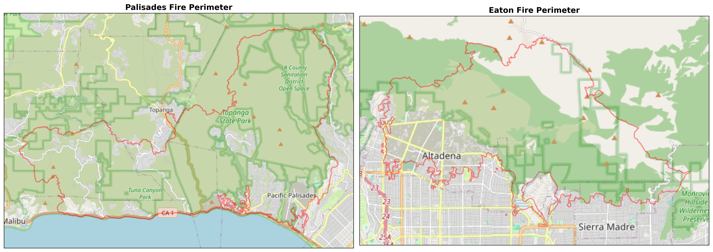

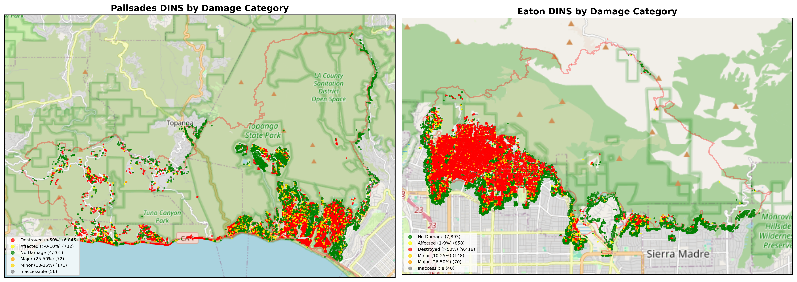

---

## Data

| Layer | Source | Resolution |
|-------|--------|------------|
| Pre/Post-fire optical (NIR, SWIR) | Sentinel-2 L2A via STAC API | 20 m |
| dNBR (delta Normalized Burn Ratio) | Computed from Sentinel-2 | 20 m |
| Topographic aspect | USGS 3DEP 10m DEM | Resampled to 20 m |
| Building footprints | Microsoft US Building Footprints | Rasterized to 20 m |
| Ground truth labels | CAL FIRE DINS field inspections | Point → 15 m buffer → raster |
| AOI boundary | NIFC FIRIS fire perimeters | Vector |

**Temporal windows:** Pre-fire: 2024-12-01 – 2025-01-06 · Post-fire: 2025-02-01 – 2025-02-28

### Preprocessing

Sentinel-2 scenes are selected by lowest cloud cover per date group, cloud-masked using the Scene Classification Layer (SCL), and mosaicked across tile boundaries (Eaton straddles two tiles).

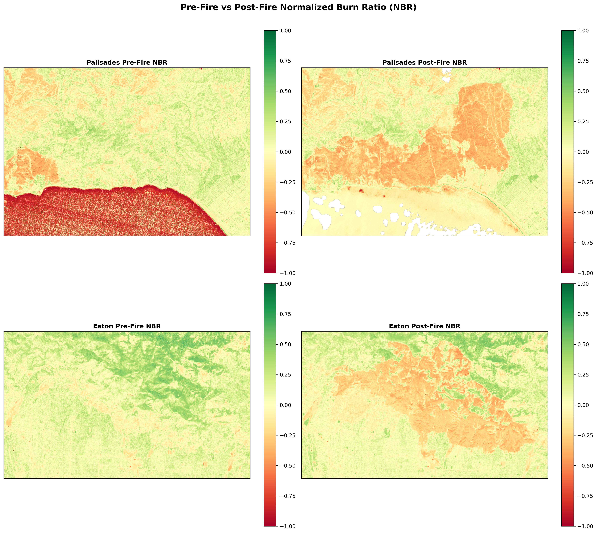

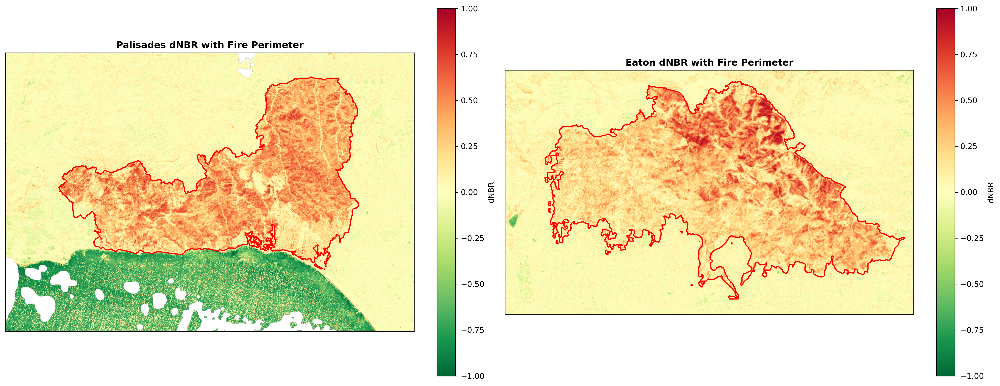

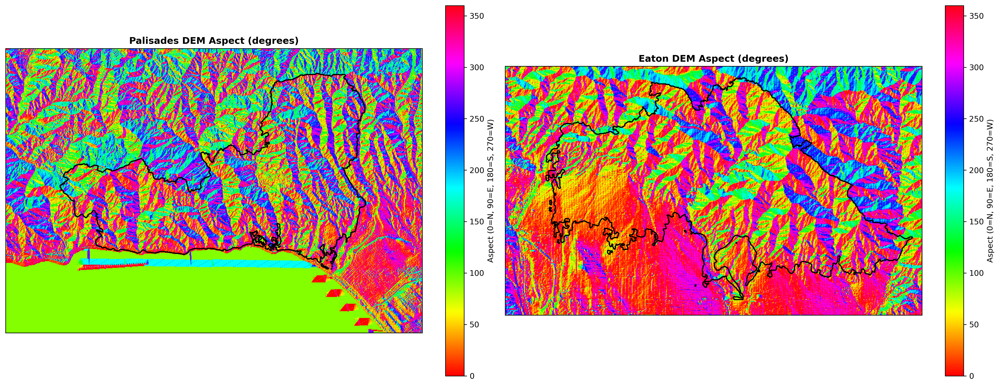

---

## Building Footprints & Labels

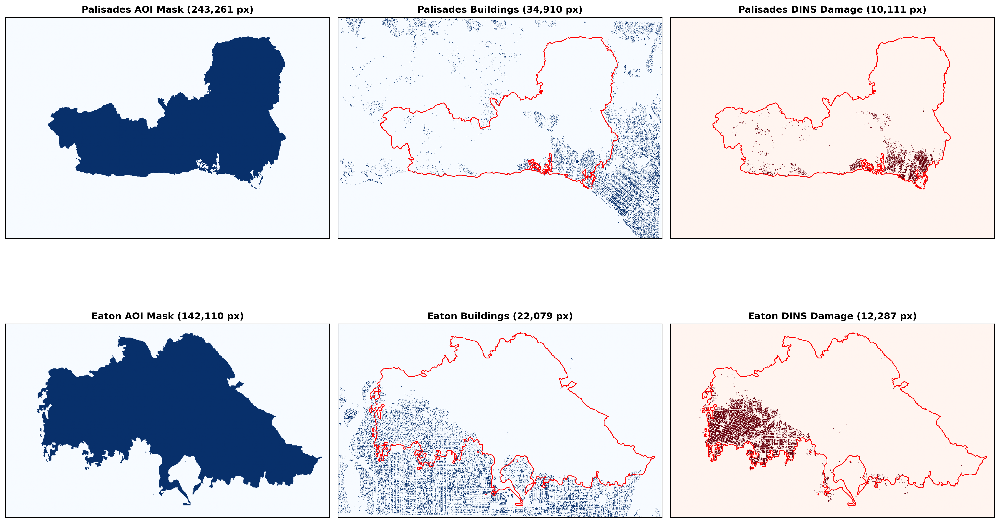

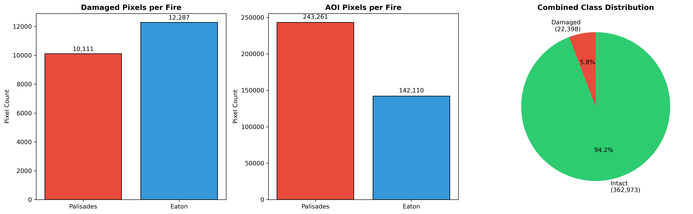

---

## Modeling Approach

The input tensor is a **7-channel** stack per pixel:

$$\mathbf{X} = [\text{dNBR},\ \text{DEM Aspect},\ \text{Building Footprints},\ \text{Pre-NIR},\ \text{Pre-SWIR},\ \text{Post-NIR},\ \text{Post-SWIR}]$$

Adding raw pre- and post-fire NIR/SWIR bands alongside dNBR gives the model direct access to absolute reflectance values, not just the derived index.

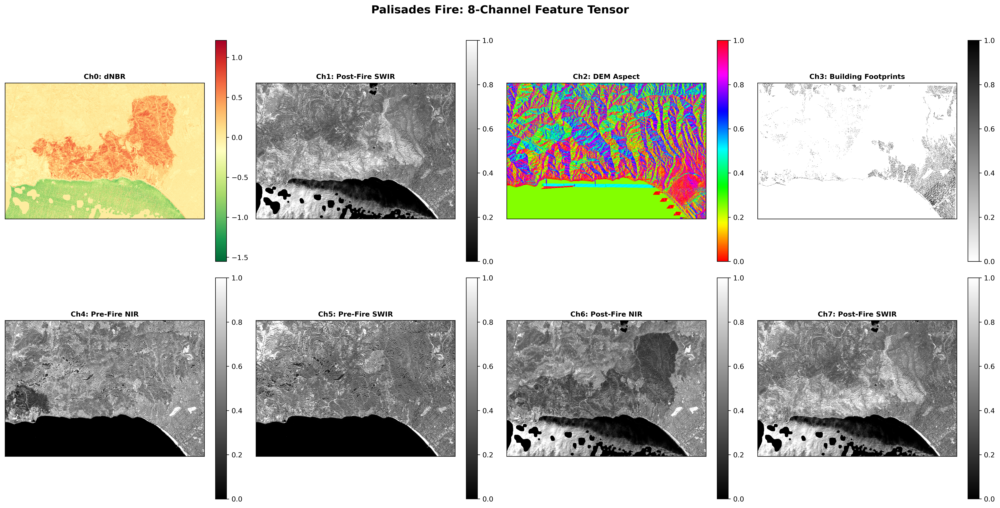

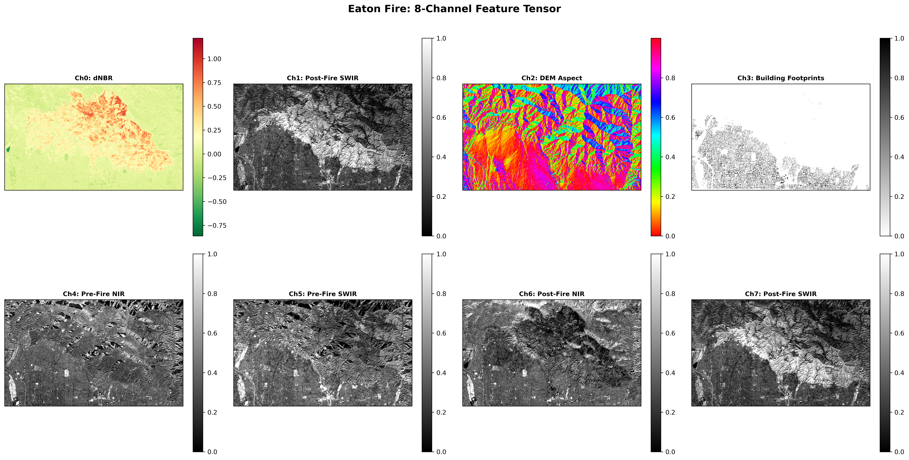

### Spatial K-Fold Cross-Validation

Traditional random splits allow spatially adjacent pixels to appear in both train and test sets, causing **spatial autocorrelation leakage** — the model trivially interpolates between neighbors rather than learning genuine predictive signal.

The solution: divide each fire's AOI into **64×64 pixel spatial blocks** with globally unique IDs, assign each block to a fold, and stratify by damage presence so each fold sees a representative proportion of the minority class.

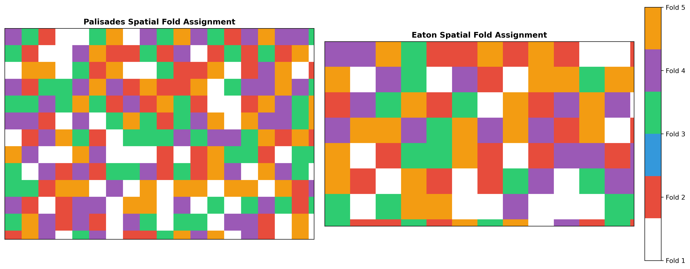

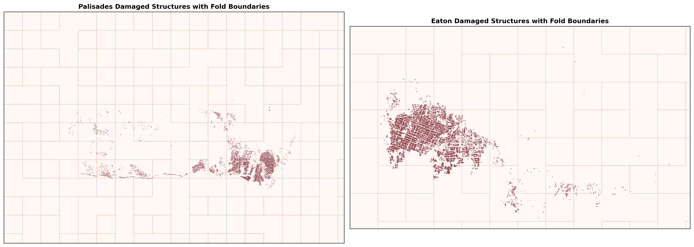

---

### Baseline: Random Forest

A pixel-wise Random Forest classifier treats each pixel independently using the 7-channel feature tensor, without considering spatial context between neighbors. This establishes a lower bound: if the U-Net can't beat Random Forest, spatial context adds no value.

**Training:** 5-fold spatial cross-validation · `class_weight="balanced"` · Evaluated on F1-Score (positive damage class only)

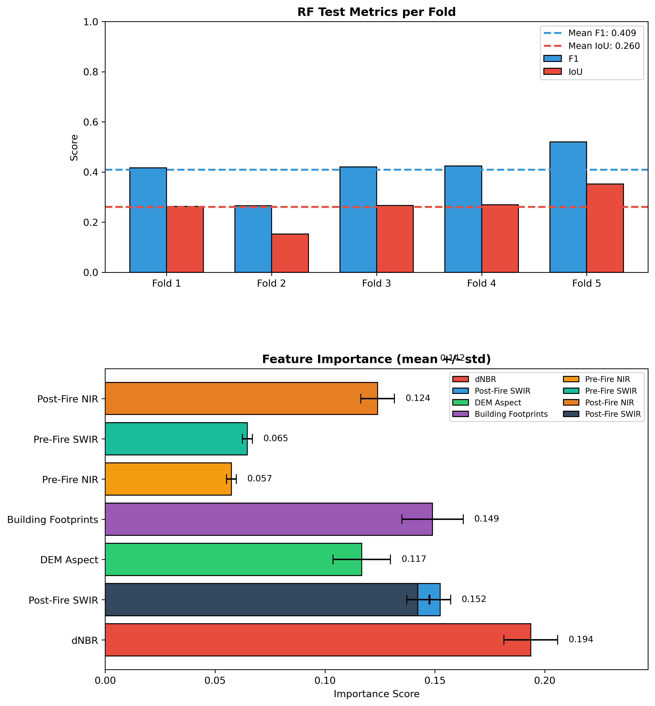

---

### Primary: Topographically-Aware U-Net

A U-Net encoder–decoder with skip connections captures both fine-grained pixel features and broad spatial context. The model learns that high dNBR on a north-facing slope *with* a building footprint signals structural damage, while the same spectral signature *without* a building may indicate shadow.

**Architecture:** Input `(64, 64, 7)` → 3-level Encoder (Conv + BatchNorm + ReLU) → Bottleneck → Decoder with skip connections → Binary sigmoid output

**Regularization:** Standard Dropout + `SpatialDropout2D` (drops entire feature maps, stronger regularizer for spatial data)

**Data augmentation:** Random horizontal/vertical flips + random 90° rotations applied during training (nadir imagery has no canonical orientation)

**Loss functions:**
- **Dice Loss** — directly optimizes F1-Score for the minority damage class
- **Focal Loss** (`alpha=0.80`, `gamma=3.0`) — down-weights easy background pixels, focuses learning on hard positives
- **Combined Loss** — equal-weight sum of both

**Training details:** Batch size 16 · Max 50 epochs · Early stopping patience 10 · `ReduceLROnPlateau` patience 5 · Positive-class patch 2× oversampling

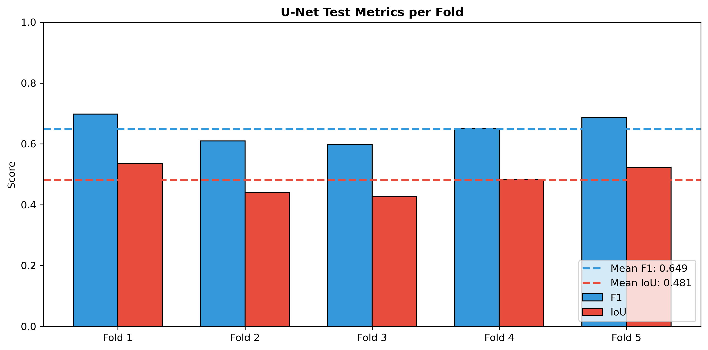

---

## Results

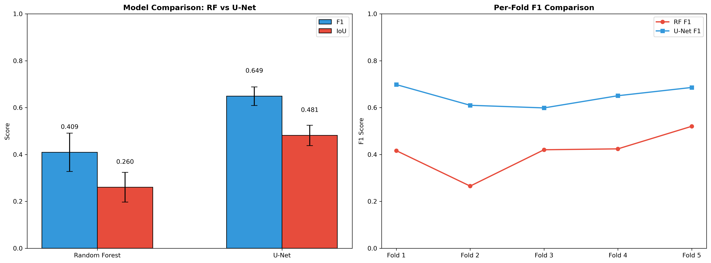

| Model | F1 (mean ± std) | IoU (mean ± std) |
|-------|-----------------|------------------|
| Random Forest (baseline) | 0.4101 ± 0.0810 | 0.2611 ± 0.0629 |
| Topographically-Aware U-Net | **0.6532 ± 0.0469** | **0.4868 ± 0.0520** |

The U-Net improves F1 by **+0.24** and IoU by **+0.23** over the Random Forest baseline. The model has confirmed predictive signal (F1 ≥ 0.50) but has not yet reached the operational utility threshold (F1 ≥ 0.70).

### Random Forest Feature Importance

| Feature | Importance (mean ± std) |
|---------|------------------------|
| Post-Fire SWIR | 0.2609 ± 0.0096 |
| dNBR | 0.2089 ± 0.0082 |
| Building Footprints | 0.1603 ± 0.0161 |
| Post-Fire NIR | 0.1063 ± 0.0037 |
| DEM Aspect | 0.1215 ± 0.0144 |
| Pre-Fire SWIR | 0.0797 ± 0.0032 |
| Pre-Fire NIR | 0.0624 ± 0.0020 |

---

## Discussion & Limitations

The expanded dataset (two fires, 7 channels, stronger regularization) substantially reduced overfitting compared to the single-fire baseline while also improving generalization performance. The U-Net's ability to leverage spatial context between neighboring pixels is the core hypothesis.

**Limitations:**
- Sentinel-2's 20m resolution may be too coarse to resolve individual structures
- DINS point labels introduce GPS drift uncertainty (~15m buffer applied)
- Cloud cover during the post-fire window constrained image availability
- Severe class imbalance (~5.8% positive pixels) makes evaluation sensitive to threshold choice
- Model has not yet reached operational utility (F1 ≥ 0.70); additional fires or higher-resolution imagery may close this gap

---

## Notebooks

::: {.callout-note}
Notebooks are best viewed via the links below.
:::

| Notebook | Open in |
|----------|---------|
| **01 — Data Preprocessing** — STAC data access, dual-fire pipeline, dNBR computation, DEM aspect, building footprint rasterization, 7-channel tensor construction | [Open in Colab](https://colab.research.google.com/github/tess-vu/vision-EO/blob/main/final/01_preprocessing.ipynb) · [nbviewer](https://nbviewer.org/github/tess-vu/vision-EO/blob/main/final/01_preprocessing.ipynb) |
| **02 — Modeling & Results** — Spatial k-fold CV, Random Forest baseline, U-Net with SpatialDropout + augmentation, model comparison | [Open in Colab](https://colab.research.google.com/github/tess-vu/vision-EO/blob/main/final/02_modeling.ipynb) · [nbviewer](https://nbviewer.org/github/tess-vu/vision-EO/blob/main/final/02_modeling.ipynb) |

[View on GitHub →](https://github.com/tess-vu/vision-EO/tree/main/final){.btn .btn-outline-primary}

---

## References

- Ngoua Ndong Avele & Goryainov (2025). Wildfire Damage Assessment over Eaton Canyon. *Environmental and Earth Sciences Proceedings*, 36(1). <https://doi.org/10.3390/eesp2025036006>
- Pinto et al. (2020). A deep learning approach for mapping and dating burned areas. *ISPRS Journal of Photogrammetry and Remote Sensing*, 160, 260–274. <https://doi.org/10.1016/j.isprsjprs.2019.12.014>
- Mayer et al. (2021). Deep learning approach for Sentinel-1 surface water mapping. *ISPRS Open Journal of Photogrammetry and Remote Sensing*, 2. <https://doi.org/10.1016/j.ophoto.2021.100005>
