## Overview

The January 2025 Los Angeles Palisades Fire burned through steep chaparral canyons directly into densely populated residential areas of the Wildland-Urban Interface (WUI). This project frames post-fire structural damage assessment as a **semantic segmentation task**: given multispectral satellite imagery, topographic data, and building footprints, can we predict which structures were destroyed — before field inspections are complete?

**Target users:** LA County Department of Regional Planning, utility providers, environmental resilience agencies.

---

## Problem & Motivation

Civic agencies currently wait for labor-intensive field inspections before allocating rebuilding resources, estimating insurance liabilities, or deploying soil stabilization teams. A pixel-level damage prediction map from satellite imagery would provide **immediate, actionable intelligence** for post-disaster zoning and debris removal prioritization.

### Key Technical Challenges

**1. Topographic shadowing** — In January, the sun sits low in the southern sky. Steep north-facing canyons cast deep shadows that produce near-zero reflectance across all optical bands, mimicking severe burn signatures. Feeding DEM-derived aspect explicitly into the model allows the network to distinguish shadow artifacts from genuine burns.

**2. Class imbalance** — Destroyed buildings represent ~2–5% of fire perimeter pixels. The model uses combined Dice Loss + Focal Loss to handle this.

**3. Target leakage prevention** — dNBR is used as an *input feature*, not a label source. Ground truth comes exclusively from [CAL FIRE DINS](https://gis.data.cnra.ca.gov/datasets/CALFIRE-Forestry::cal-fire-damage-inspection-dins-data) field inspections, ensuring the model learns predictive relationships rather than circular spectral thresholds.

---

## Study Area

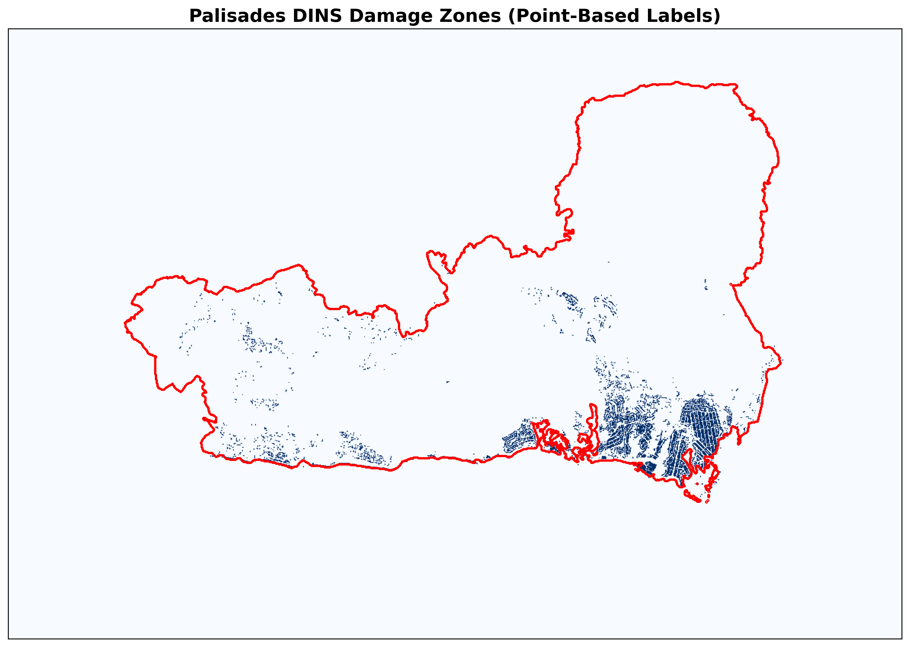

---

## Data

| Layer | Source | Resolution |
|-------|--------|------------|
| Pre/Post-fire optical (NIR, SWIR) | Sentinel-2 L2A via STAC API | 10–20 m |
| dNBR (delta Normalized Burn Ratio) | Computed from Sentinel-2 | 20 m |
| Topographic aspect | USGS 3DEP 10m DEM | 10 m |
| Building footprints | Microsoft US Building Footprints | Rasterized to 20 m |
| Ground truth labels | CAL FIRE DINS field inspections | Point → raster |
| AOI boundary | LA County dissolved fire perimeter | Vector |

### Preprocessing

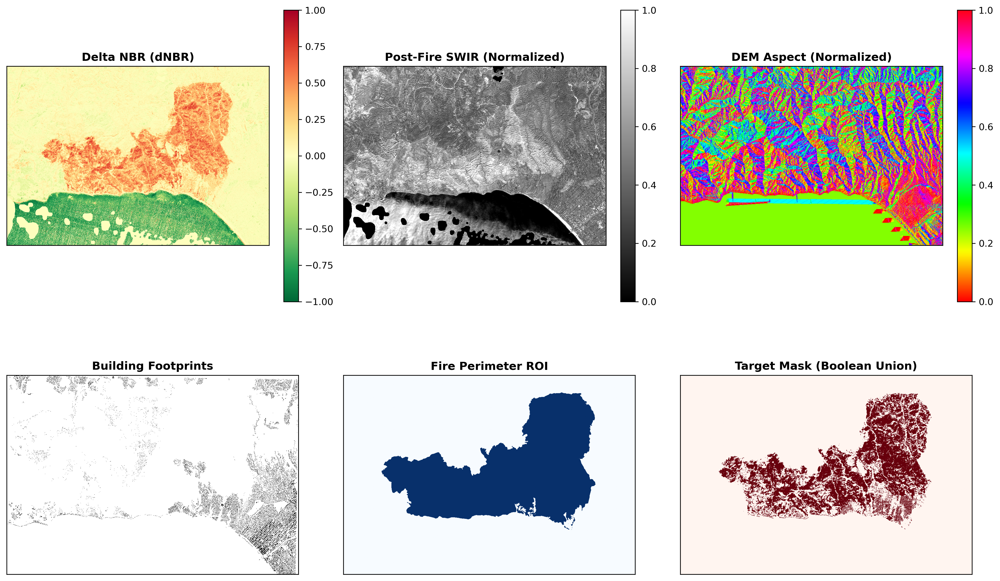

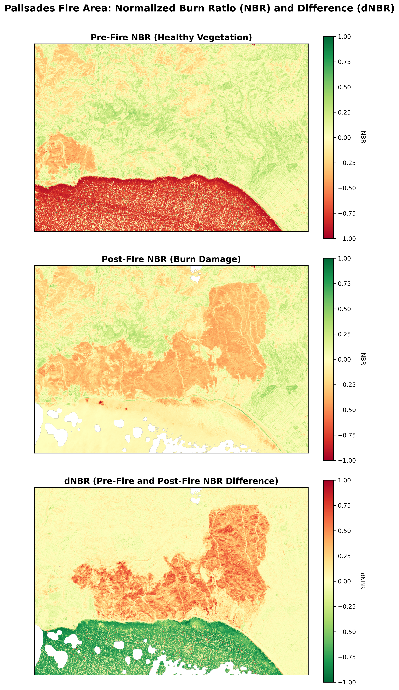

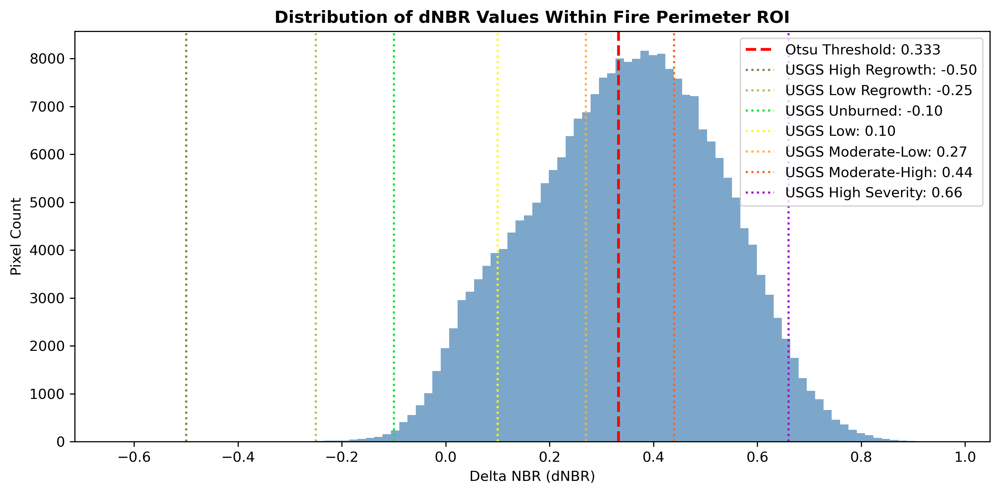

---

## Building Footprints & Labels

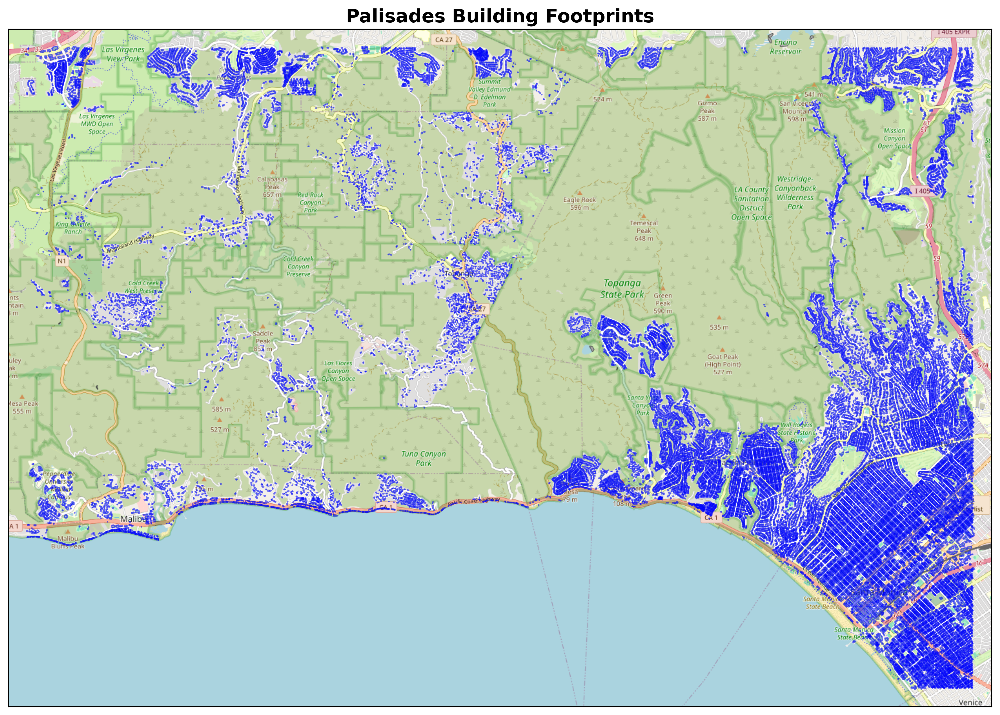

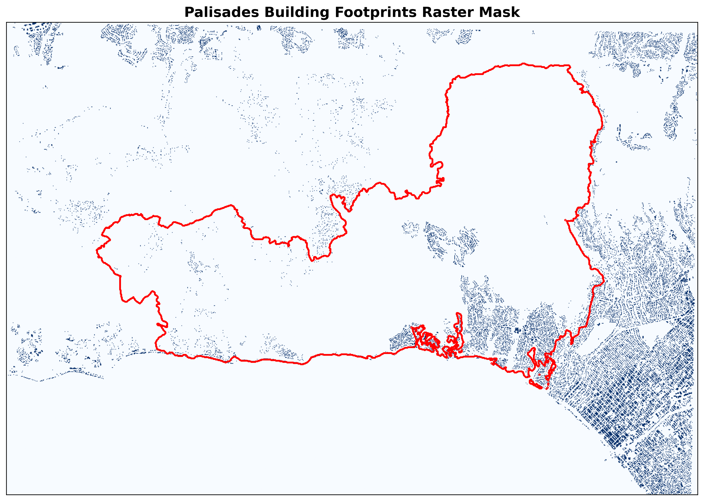

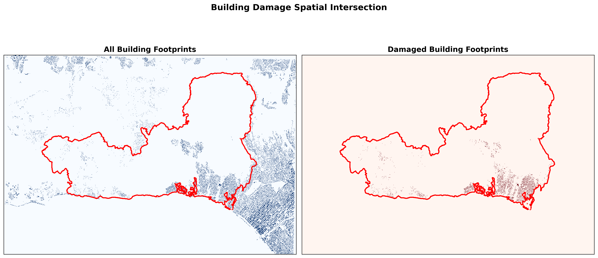

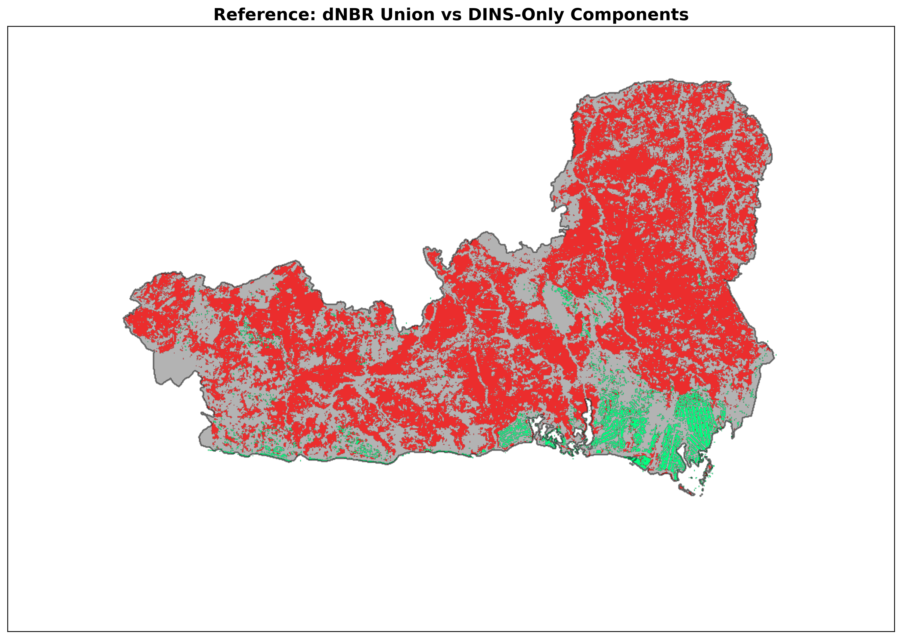

---

## Modeling Approach

The input tensor is a 4-channel stack per pixel:

$$\mathbf{X} = [\text{dNBR},\ \text{Post-Fire SWIR},\ \text{DEM Aspect},\ \text{Building Footprints}]$$

### Baseline: Random Forest

A pixel-wise Random Forest classifier treats each pixel independently, establishing a performance floor. Because it ignores spatial context between neighboring pixels, the U-Net should exceed it if spatial relationships matter for damage prediction.

### Primary: Topographically-Aware U-Net

A U-Net encoder–decoder with skip connections captures both fine-grained pixel features and broad spatial context. By explicitly feeding topographic aspect alongside spectral bands and building footprints, the model learns that high dNBR on a north-facing slope *with* a building footprint signals structural damage, while the same spectral signature *without* a building may indicate shadow.

**Training details:**
- Loss: Dice Loss + Focal Loss (handles class imbalance)
- Positive-class oversampling in patch selection
- Spatial block cross-validation (64×64 px blocks) — prevents spatial autocorrelation leakage
- Split: 70% train / 15% validation / 15% test

### Spatial K-Fold Distribution

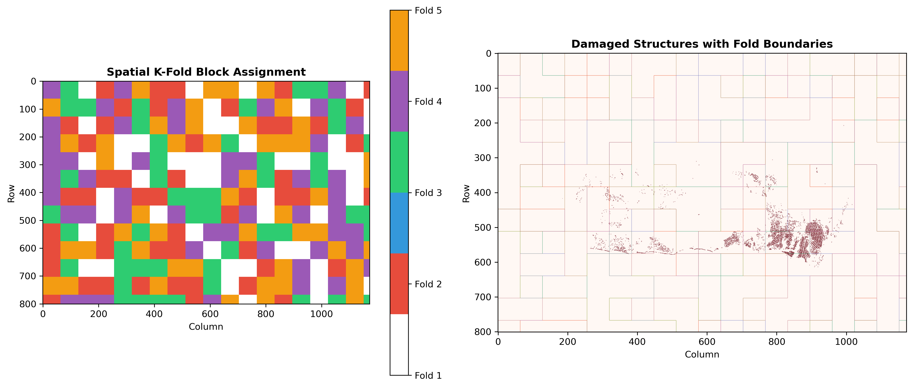

---

## Results

### Metrics (positive damage class only)

| Model | IoU | F1 / Dice |
|-------|-----|-----------|
| Random Forest | — | — |
| U-Net (topographic) | — | — |

> Results shown in notebooks below.

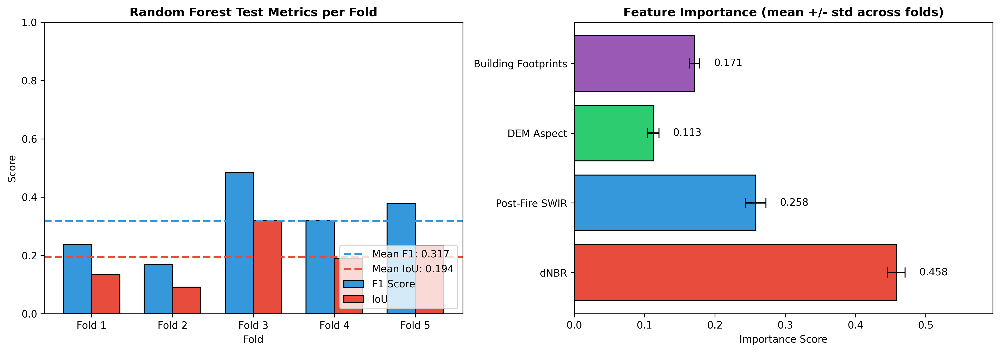

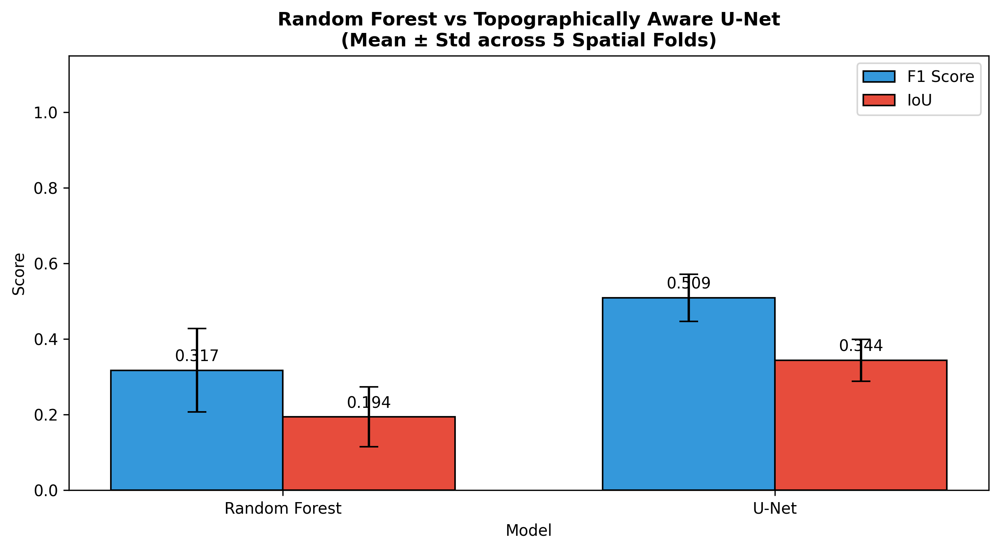

---

## Notebooks

### Data Preprocessing



---

### Modeling & Results



---

## References

- Ngoua Ndong Avele & Goryainov (2025). Wildfire Damage Assessment over Eaton Canyon. *Environmental and Earth Sciences Proceedings*, 36(1). <https://doi.org/10.3390/eesp2025036006>
- Pinto et al. (2020). A deep learning approach for mapping and dating burned areas. *ISPRS Journal of Photogrammetry and Remote Sensing*, 160, 260–274. <https://doi.org/10.1016/j.isprsjprs.2019.12.014>
- Mayer et al. (2021). Deep learning approach for Sentinel-1 surface water mapping. *ISPRS Open Journal of Photogrammetry and Remote Sensing*, 2. <https://doi.org/10.1016/j.ophoto.2021.100005>
