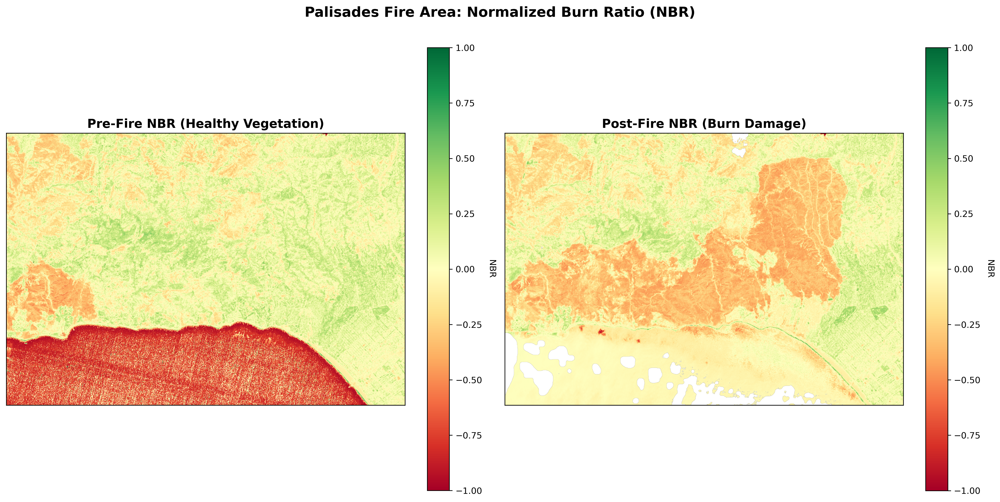

## Overview

The January 2025 Los Angeles Palisades Fire burned through steep chaparral canyons directly into densely populated residential areas of the Wildland-Urban Interface (WUI). This project frames post-fire structural damage assessment as a **semantic segmentation task**: given multispectral satellite imagery, topographic data, and building footprints, can we predict which structures were destroyed — before field inspections are complete?

**Target users:** LA County Department of Regional Planning, utility providers, environmental resilience agencies.

---

## Problem & Motivation

Civic agencies currently wait for labor-intensive field inspections before allocating rebuilding resources, estimating insurance liabilities, or deploying soil stabilization teams. A pixel-level damage prediction map from satellite imagery provides **immediate, actionable intelligence** for post-disaster zoning and debris removal prioritization.

### Key Technical Challenges

**1. Topographic shadowing** — In January, the sun sits low in the southern sky. Steep north-facing canyons cast deep shadows that mimic severe burn spectral signatures. DEM-derived aspect is fed explicitly into the model to distinguish shadow artifacts from genuine burns.

**2. Class imbalance** — Destroyed buildings represent ~2–5% of fire perimeter pixels. Combined Dice Loss + Focal Loss addresses this.

**3. Target leakage prevention** — dNBR is an *input feature*, not a label source. Ground truth comes exclusively from [CAL FIRE DINS](https://gis.data.cnra.ca.gov/datasets/CALFIRE-Forestry::cal-fire-damage-inspection-dins-data) field inspections, ensuring the model learns predictive relationships rather than circular spectral thresholds.

---

## Study Area

---

## Data

| Layer | Source | Resolution |
|-------|--------|------------|
| Pre/Post-fire optical (NIR, SWIR) | Sentinel-2 L2A via STAC API | 10–20 m |
| dNBR (delta Normalized Burn Ratio) | Computed from Sentinel-2 | 20 m |
| Topographic aspect | USGS 3DEP 10m DEM | 10 m |
| Building footprints | Microsoft US Building Footprints | Rasterized to 20 m |
| Ground truth labels | CAL FIRE DINS field inspections | Point → raster |
| AOI boundary | LA County dissolved fire perimeter | Vector |

### Preprocessing

---

## Building Footprints & Labels

---

## Modeling Approach

The input tensor is a 4-channel stack per pixel:

$$\mathbf{X} = [\text{dNBR},\ \text{Post-Fire SWIR},\ \text{DEM Aspect},\ \text{Building Footprints}]$$

### Spatial K-Fold Cross-Validation

Traditional random splits allow spatially adjacent pixels to appear in both train and test sets, causing **spatial autocorrelation leakage** — the model trivially interpolates between neighbors rather than learning genuine predictive signal.

The solution: divide the AOI into **64×64 pixel spatial blocks**, assign each block to a fold, and stratify by damage presence so each fold sees a representative proportion of the minority class.

---

### Baseline: Random Forest

A pixel-wise Random Forest classifier treats each pixel independently using the 4-channel feature tensor, without considering spatial context between neighbors. This establishes a lower bound: if the U-Net can't beat Random Forest, spatial context adds no value.

**Training:** 5-fold spatial cross-validation · Evaluated on F1-Score (positive damage class only)

---

### Primary: Topographically-Aware U-Net

A U-Net encoder–decoder with skip connections captures both fine-grained pixel features and broad spatial context. The model learns that high dNBR on a north-facing slope *with* a building footprint signals structural damage, while the same spectral signature *without* a building may indicate shadow.

**Architecture:** Input `(64, 64, 4)` → Encoder (Conv + BatchNorm + ReLU blocks) → Bottleneck → Decoder with skip connections → Binary output mask

**Loss functions:**
- **Dice Loss** — directly optimizes F1-Score for the minority damage class
- **Focal Loss** — down-weights easy background pixels, focuses learning on hard positives
- **Combined Loss** — weighted sum of both

**Metrics:** Dice Coefficient · IoU (Jaccard Index)

**Training:** 5-fold spatial CV · Positive-class patch oversampling · Split 70/15/15

---

## Results

| Model | F1 (Dice) | IoU |
|-------|-----------|-----|
| Random Forest (baseline) | — | — |
| Topographically-Aware U-Net | — | — |

> Full per-fold metrics in the notebook.

---

## Discussion & Limitations

The U-Net's ability to leverage spatial context between neighboring pixels is the core hypothesis. Results assess whether spectral + topographic + footprint features carry genuine predictive signal for independently-assessed structural damage — a relationship that may or may not exist at Sentinel-2's 20m resolution.

**Limitations:**
- Sentinel-2's 20m resolution may be too coarse to resolve individual structures
- DINS point labels introduce GPS drift uncertainty (~15m buffer applied)
- Cloud cover during the post-fire window constrained image availability
- Severe class imbalance (~2–5% positive pixels) makes evaluation sensitive to threshold choice

---

## Notebooks

::: {.callout-note}
Notebooks are best viewed via the links below.
:::

| Notebook | Description |
|----------|-------------|
| [01 — Data Preprocessing](https://nbviewer.org/github/tess-vu/vision-EO/blob/main/final/01_data_preprocessing.ipynb) | STAC data access, dNBR computation, DEM aspect, building footprint rasterization, target mask generation |
| [02 — Modeling & Results](https://nbviewer.org/github/tess-vu/vision-EO/blob/main/final/02_modeling_approach.ipynb) | Spatial k-fold CV, Random Forest baseline, U-Net architecture, training loop, model comparison |

[View all notebooks on GitHub →](https://github.com/tess-vu/vision-EO/tree/main/final){.btn .btn-outline-primary}

---

## References

- Ngoua Ndong Avele & Goryainov (2025). Wildfire Damage Assessment over Eaton Canyon. *Environmental and Earth Sciences Proceedings*, 36(1). <https://doi.org/10.3390/eesp2025036006>
- Pinto et al. (2020). A deep learning approach for mapping and dating burned areas. *ISPRS Journal of Photogrammetry and Remote Sensing*, 160, 260–274. <https://doi.org/10.1016/j.isprsjprs.2019.12.014>
- Mayer et al. (2021). Deep learning approach for Sentinel-1 surface water mapping. *ISPRS Open Journal of Photogrammetry and Remote Sensing*, 2. <https://doi.org/10.1016/j.ophoto.2021.100005>
