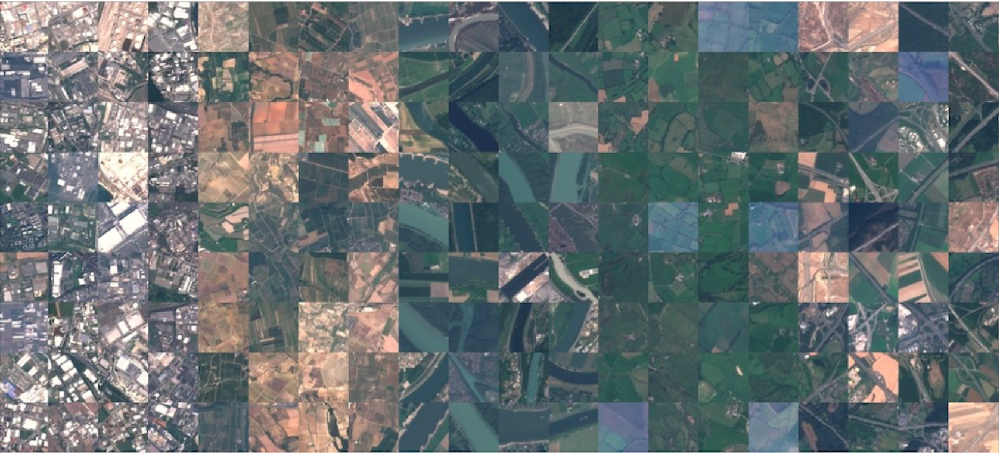
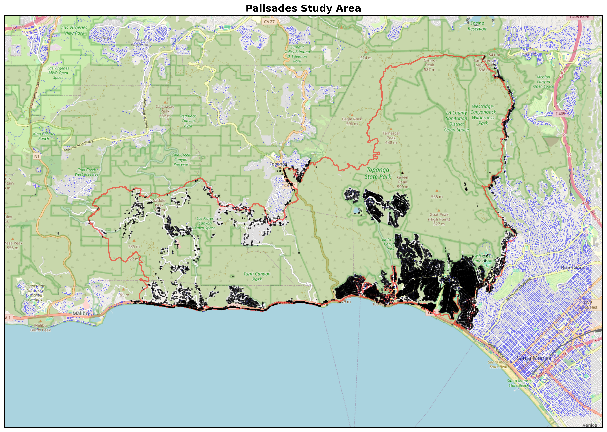

::: {.hero-banner style="text-align:center; padding: 3rem 1rem 2rem;"}

# Vision × Earth Observation

**Remote Sensing · Deep Learning · Cloud-Native Geospatial**

*Tess Vu · Luciano Lu · Ming Cao — UPenn 2026*

:::

---

## Projects

:::: {.grid}

::: {.g-col-12 .g-col-md-6}

### [EuroSAT Land Cover Classification](eurosat.qmd)

{.img-fluid style="border-radius:8px; margin-bottom:1rem;"}

Supervised and unsupervised classification of multispectral Sentinel-2 imagery across 10 land-use categories using the EuroSAT benchmark dataset. Implemented CNNs and compared against traditional ML baselines.

[View Project →](eurosat.qmd){.btn .btn-primary}

:::

::: {.g-col-12 .g-col-md-6}

### [2025 LA Palisades Fire Damage Prediction](final-project.qmd)

{.img-fluid style="border-radius:8px; margin-bottom:1rem;"}

Topographically-aware U-Net semantic segmentation to predict structural damage from the January 2025 Palisades wildfire using Sentinel-2 imagery, DEM aspect, and CAL FIRE DINS field assessments as ground truth.

[View Project →](final-project.qmd){.btn .btn-primary}

:::

::::

---

## About

This portfolio presents work from a Computer Vision and Earth Observation course, applying supervised/unsupervised machine learning and deep learning (CNNs) to aerial and satellite imagery. Projects use cloud-native geospatial workflows with STAC APIs and real-world remote sensing data.

**Stack:** Python · PyTorch · Sentinel-2 · Google Earth Engine · STAC API · scikit-learn · GeoPandas

